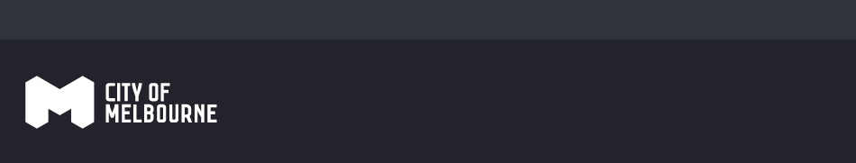
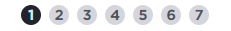

# Global Elements 
---

Welcome to the template page. I've laid out commonly used components so you can just copy this page when you want to create a new page for instance. Or as a reference for components, you know you'll find them here if you need them!
This is the page intro style. Just your standard body text.


## Global elements
---

### Header - desktop >767px
At 768px and greater height increases, logo updates to larger format. Logo links to http://www.melbourne.vic.gov.au



```
height:145.938px

background-color: rgb(35, 36, 43);
box-sizing: border-box;
color: rgb(255, 255, 255);
display: block;
font-family: "Gotham SSm A", "Gotham SSm B", Arial, Helvetica, sans-serif;
font-size: 16px;
font-weight: 400;
height: 145.938px;
line-height: 16px;
padding-top: 8px;
text-size-adjust: 100%;
width: 768px;
-webkit-tap-highlight-color: rgba(0, 0, 0, 0);

```

### Header - mobile <767px
At 767px wide and less, height decreases, logo updates to smaller format. Logo links to http://www.melbourne.vic.gov.au


```
height:30px

background-color: rgb(35, 36, 43);
box-sizing: border-box;
color: rgb(255, 255, 255);
display: block;
font-family: "Gotham SSm A", "Gotham SSm B", Arial, Helvetica, sans-serif;
font-size: 16px;
font-weight: 400;
height: 30px;
line-height: 16px;
padding-top: 8px;
text-size-adjust: 100%;
width: 767px;
-webkit-tap-highlight-color: rgba(0, 0, 0, 0);

```

### Form progress indicator
Indicates how many steps there are to complete form. Highlights which step cusomter's currently on



```
.steps-wizard .wizard-progress .step.future {
 background-image: url(/images/wizard-progress-future.png);
}
dci.wizard.css:100
.steps-wizard .wizard-progress .step {
 width: 20px;
 height: 20px;
 color: #50535d;
 background: url(/images/wizard-progress-future.png) 100% 100% no-repeat;
 display: inline-block;
 margin: 0 4px;
 font-size: 14px;
 font-weight: 700;
 background-size: 100% 100%;
 background-repeat: no-repeat;
 line-height: 1.5;
 text-decoration: none;

```

### Page heading
Titles the service. Titles the current screen with overall theme of intent.


```
Service title

box-sizing: border-box;
color: rgb(102, 102, 102);
display: block;
font-family: "Gotham SSm A", "Gotham SSm B", Arial, Helvetica, sans-serif;
font-size: 16px;
font-weight: 400;
height: 20px;
line-height: 20px;
margin-bottom: 5px;
margin-left: 0px;
margin-right: 0px;
margin-top: 10px;
text-align: center;
text-size-adjust: 100%;
width: 593.6px;
-webkit-tap-highlight-color: rgba(0, 0, 0,);


Page title

box-sizing: border-box;
color: rgb(255, 255, 255);
display: block;
font-family: "Gotham SSm A", "Gotham SSm B", Arial, Helvetica, sans-serif;
font-size: 16px;
font-weight: 400;
height: 15.05px;
line-height: 16px;
margin-left: 0px;
margin-right:0px;
padding-left: 15px;
padding-right: 15px;
text-size-adjust: 100%;
width: 593.6px;
-webkit-tap-highlight-color: rgba(0, 0, 0,);

```

### Green box "Did you know?"
Informs customer with important service process related information.


```
background-color: rgb(225, 236, 198);
background-image: url(https://preprod.services.melbourne.vic.gov.au/images/question_mark.png);
background-position-x: 13px;
background-position-y: 12px;
background-repeat-x: ;
background-repeat-y: ;
border-bottom-color: rgb(0, 136, 80);
border-bottom-style: solid ;
border-bottom-width: 1px;
border-image-outset: 0px;
border-image-repeat: stretch;
border-image-slice: 100%;
border-image-source: none;
border-image-width: 1;
border-left-color: rgb(0, 136, 80);
border-left-style: solid;
border-left-width: 1px;
border-right-color: rgb(0, 136, 80);
border-right-style: solid;
border-right-width: 1px;
border-top-color: rgb(0, 136, 80);
border-top-style: solid;
border-top-width: 1px;
box-sizing: border-box;
color: rgb(51, 51, 51);
display: block;
font-family:
"Gotham SSm A", "Gotham SSm B", Arial, Helvetica, sans-serif;
font-size: 16px;
font-weight: 400;
height: 100.6px;
line-height: 21.328px;
margin-bottom: 32px;
padding-bottom: 13px;
padding-left: 13px;
padding-right: 13px;
padding-top: 13px;
text-size-adjust: 100%;
width: 520px;
-webkit-tap-highlight-color: rgba(0, 0, 0,);

```


