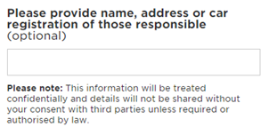

# Input Fields
* * *
Browser display: __Desktop__ - Input displays at width: 355px, height: 38px; | __Mobile__ - Input displays at width: 300x, height: 38px;
## Single line text field - generic text capture
### What it does 
- Captures mobile phone numbers, formatted to standard AU mobile numbers
- Displays error text upon validation rules not met when mandatory and marked as (required)
### Input
 
### Error
  
## Single line text field + description - generic text capture
### What it does 
- Captures mobile phone numbers, formatted to standard AU mobile numbers
- Displays error text upon validation rules not met when mandatory and marked as (required)
### Input
  
### Error
 
## Single line text field - mobile phone number capture
### What it does 
- Captures mobile phone numbers, formatted to standard AU mobile numbers
- Displays error text upon validation rules not met when mandatory and marked as (required)
### Validation Rules
- Must start with 04
- Must be numeric
- Must contain 10 digits
## Multi-line text field + description - generic text capture
### Input
  
### What it does 
- Captures mobile phone numbers, formatted to standard AU mobile numbers
- Displays error text upon validation rules not met when mandatory and marked as (required)
## Dropdown list - selection capture
### What it does
### Input
### Error
## Radio button list - selection capture
### What it does
### Input
  
### Error
 
## Checkbox list - selection capture
### What it does 
- Captures multiple answers and helps direct the Case to a team or contractor.
### Input
  
### Error
 

