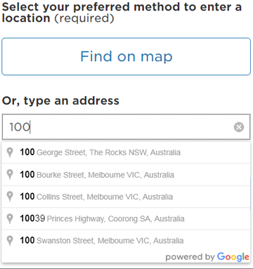

### Enter a location typing an address
Customer is presented with option to provide a known address or location.

 

### Enter a location typing an address
On focusing on the 'Or type an address' input field the google autocomplete address api is fired and the standard interaction occurs; Drop down list of address matches are displayed.

The customer is able to select one of the matches from the list or continue typing their own address.

 

### Enter a location typing an address
Once an address value has been validated by the api then the 'Confirm' button becomes active and is updated to blue to alert the customer then can continue.

 

### Enter a location typing an address
This step serves as a check point to review the address they have provided and an opportunity to provide additional written information about the address. 

 

### Enter a location typing an address
Selecting 'Edit' opens the address value in an editable text input field.

Upon re-typing the input field functions as google autocomplete address feature (shown in step 2)

 
