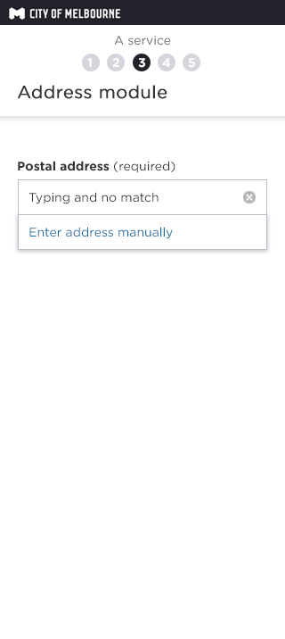
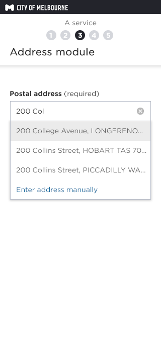

### Step 1: On page load
Customer is presented with option to provide a known address or location.

 

### Step 1b: On page load if Weave API not available
Scenario 1: 
no api and customer types 5 chars or more:

IF

CUSTOMER enters an address string

AND

loses focus of address field

THEN,

address fields expand

AND

address data string is cleared

AND

Step 4 is displayed (via expand transition)

Scenario 2:
no api and customer types 5 chars or more AND

IF

Customer enters an address string

AND

hits send/next button

OR

Hits enter key

THEN

address fields expand

AND address data string is cleared

AND validation rules occur

Working notes:

WEAVE CoM address capture - Postcode validation - Must be at least 4 digits, NUMERIC ONLY, Must start with a 3

 

### Step 2: Type address (no match)
Customer is presented with option to provide a known address or location.

 

### Step 2b:Type address (match)
Customer is presented with option to provide a known address or location.

 

### Step 3: Fields populated on match selection
- Choose another address - goes back to Step 1. 
- Enter address manually - goes to Step 4.

 

### Step 4: Enter address manually
WEAVE CoM address capture - 'Choose another address' text link - goes back to Step 1

 
