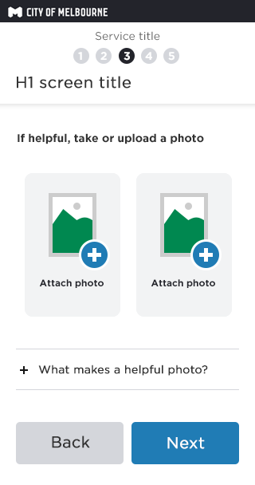
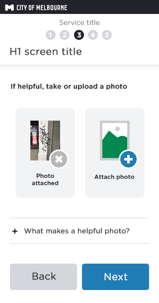
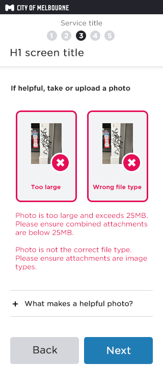
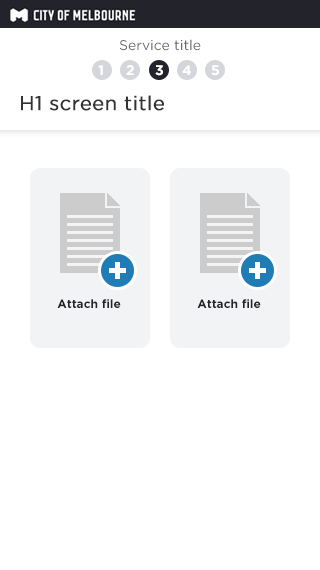
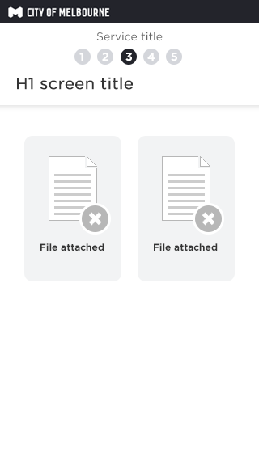

### What is it?

Buttons to open the attach file dialog window (device & OS dependent)
Customers are able to attach photo's or files to include with the Salesforce case created.  

### How does this template work?

Buttons in the form of images are used on the screen to open the attach file dialog window for the customers device. 
When they open the dialog window, all steps to find, select and attach are dependent upon the customers device and we have no control over that.
We do have control over the file types accepted and the file size. 

When the service prefers a photo, we ask specifically and use icons for the imagery that reflect an image file. 
When the service prefers a text file (non image files), like a word document, then we use icons that reflect file types that would contain text. 

Screen flows below show both examples of button interactions and states. 

## Attach photos

### Attaching a photo file
Customer clicks the 'attach photo' button and opens the device or computers attach file dialog window to find the file.

### Photo file attached
Customer clicks the 'attach photo' button and opens the device or computers attach file dialog window to find the file.

### Errors
If the validation rules are not met then the error state of each button is displayed. The above examples shows both possible error messages.

**Validation rule**
This needs checking as it's changed recently?

## Attach files

### Attaching files
Customer clicks the 'attach photo' button and opens the device or computers attach file dialog window to find the file. 

### File attached
Once the file is successfully loaded the icon and call-to-action copy updates to confirm it's attached.

### Errors
If the validation rules are not met then the error state of each button is displayed. The above examples shows both possible error messages.

**Validation rule**
This needs checking as it's changed recently?

