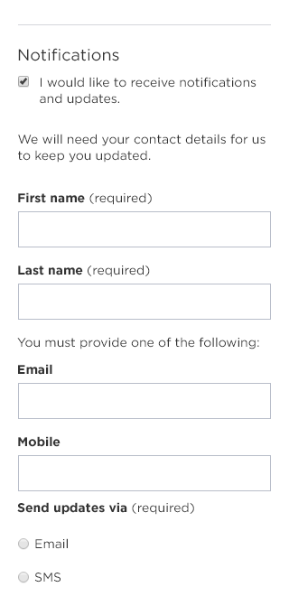

# Confirm and send 

## What is it?

**Replays location information to confirm and an opportunity to opt in for notifications.** 

Also;

* It also asks to capture any additional information that the customer chooses to provide. 
* Dependent upon the service requiring customer contact details, it can also prompt for mandatory contact details by way of exception to complete the customer request. 

## How does this template work?

**This step consists of different data capture modules - opt in for notifications, contact details.** 

The current version of this step is below, and marked as current prod version.
| Text |text| text | text |
| ----- | ----- | ----- |
|  |  |  | nada |

### This is a display title
Below is a table to display content side-by-side.

| ||  |
