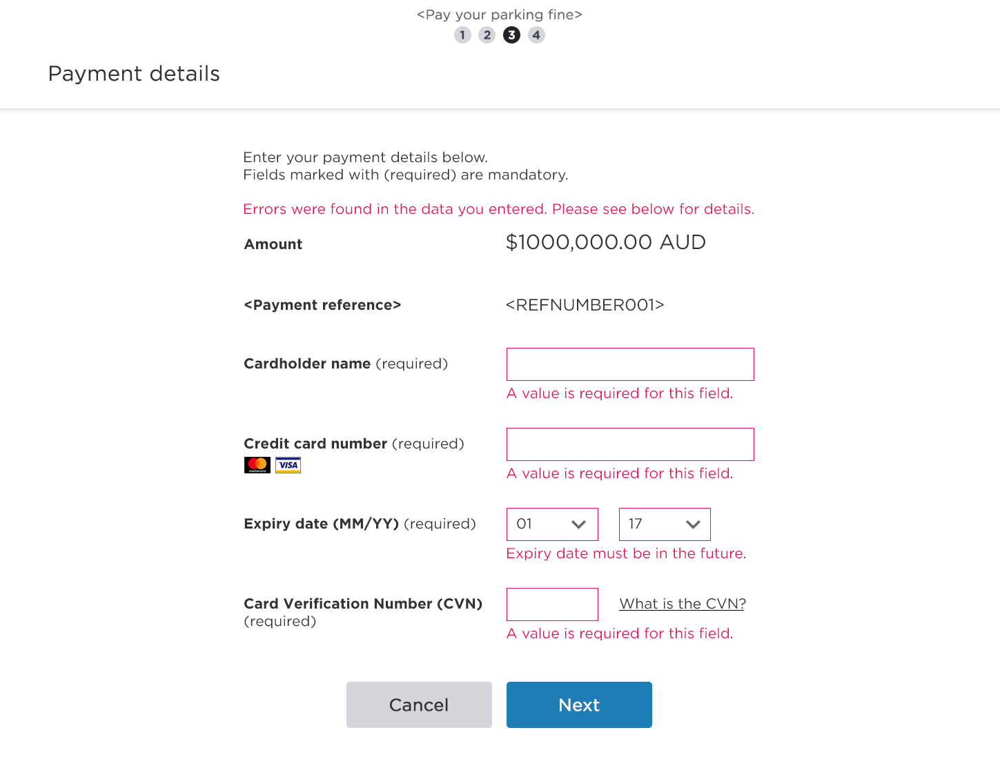
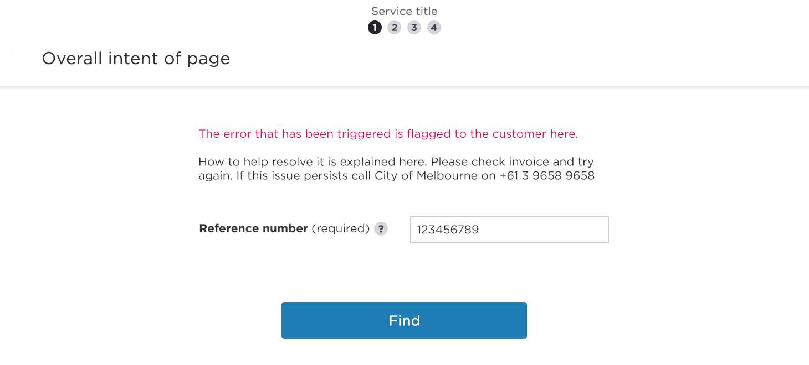
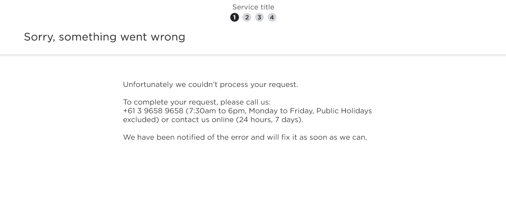

## Generic form error

We want to alert them to an issue, not alarm them. We should provide customers an alternative path to resolve their issue.

Customer wrote something that wasn't quite right.

**Front end validation**

The page scrolls to top - this is to alert the customer there
are errors. This is typically on a longer page with multiple 
inputs as point of error.

Each input error is flagged with border colour and error 
message directly below the input field.

Colour is used to highlight what needs updating to 
remedy the error.

## Data error

We've not been able to find some information.

**Back end validation**

The page scrolls to top - this is to alert the customer 
there's an error. 

We inform the customer that something they have 
queried is not correct. 

In this scenario the customer will not be bale to remedy
the issue themselves. We message accordingly per 
service.

## System error

Something is broken.

**Infrastructure is down**

This could be for a number of reasons so a generic 
error message is shown. We message accordingly 
per service.
