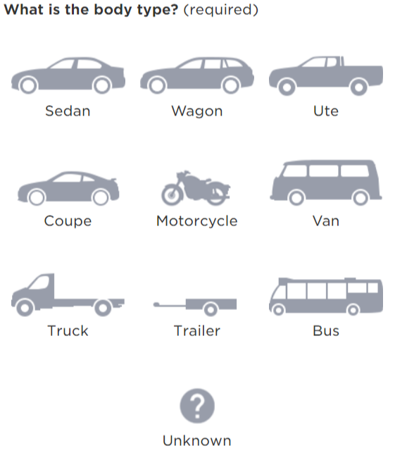

# Images - Identifying a vehicle 

## What is it?
A multiple choice question using images for radio button selections. 
For reporting illegally parked or abandoned vehicles it may help to show them images of vehicles alongside the labels for each type. 
By including the basic shape of each possible vehicle we may be able to help them choose and describe the correct vehicle they're reporting.  

## How does this template work?

A customer selects one of the images. 
The image updates to include a green tick icon to confirm the selection. 
If the customer selects unknown, then a free text field is revealed to capture 

The screen works the same way as a multiple choice question using radio buttons. 
Only one vehicle type can be chosen (currently) as the template uses radio buttons. 

### Vehicle type identification - page load

All vehicle shapes displayed as icons.

### Vehicle type identification - selected

User selects a vehicle shape. 

### Vehicle type identification - unknown

If 'Unknown' selected then mandatory multi-line input displayed to allow for a description.

### Vehicle type identification - error

Error on blank input

