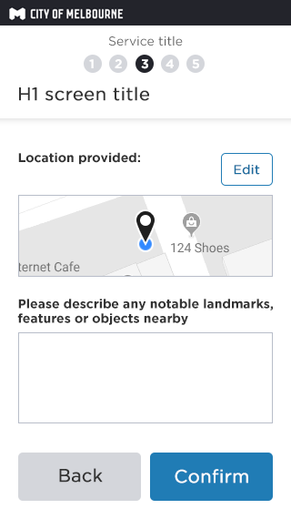

# Location Map

## What is it?
__Presents the customer options top provide a location__
Used for capturing the location of any point of public space within the CoM boundary.
Customer can choose between using a map or typing an address.
Screen flows below show both options under 'how does it work?'

## Find on map

### 1.Provide a location using THE MAP

__Method of providing location or address__
Customer is presented with option to provide a known address or location.
__Buttons__
If the screen is the first step in the form, then one button spanning the full width is used - as above.
If the module is a step in the middle of a form flow, then 'Back' and 'Next' buttons are shown.

### 2.Full screen map - Move map location to pin

__The full screen map__
On selecting 'Find on map' a full screen map is displayed, with a centered pin. 

On interaction the the map is movable, the pin remains static. 

__Location services__
If location services ON (example above)
'Go to current location' button IS displayed above the 'Back' and 'Confirm' buttons. 

__If location services are OFF__ 
'Go to current location' button IS NOT displayed above the 'Back' and 'Next' buttons. 
The map location defaults to the town hall.

Selecting 'Back' takes the user back to the previous step. 

Selecting 'Next' takes the user to step 3 __'Confirming the data provided'__ 

### 3.Optionally add location detail

__Confirming the data provided__
This step serves as a check point to review the location they have provided and an opportunity to provide additional written information about the location. 

__Edit button__
Selecting 'Edit' opens the map full screen again.
-map image displays
-__NO__ location description displays
And the customer can click 'confirm' to continue through the form

## Type an address

### 1.Provide a location using THE ADDRESS MATCH 

__Method of providing location or address__
Customer is presented with option to provide a known address or location.
__Buttons__
If the screen is the first step in the form, then one button spanning the full width is used - as above.
If the module is a step in the middle of a form flow, then 'Back' and 'Next' buttons are shown. 

### 2.Matched addresses

__Address matching__
Address input field on typing 5+ characters will attempt to match the typed address string

### 4.Selection made

## Where is it used?

- __Graffiti__ [https://dev01.dev.services.melbourne.vic.gov.au/report/graffiti](https://dev01.dev.services.melbourne.vic.gov.au/report/graffiti)  __Yes__  
- __Tree Maintenance__ [https://dev01.dev.services.melbourne.vic.gov.au/report/treemaintenance](https://dev01.dev.services.melbourne.vic.gov.au/report/treemaintenance)  __Yes(Private trees part of the flow only )__
- __Abandoned Vehicle__ [https://dev01.dev.services.melbourne.vic.gov.au/report/abandonedvehicle ](https://dev01.dev.services.melbourne.vic.gov.au/report/abandonedvehicle )  __Yes__
- __Illegally Parked Vehicle__ [https://dev01.dev.services.melbourne.vic.gov.au/report/illegallyparkedvehicle](https://dev01.dev.services.melbourne.vic.gov.au/report/illegallyparkedvehicle)  __Yes__
- __Syringe Management__ [https://dev01.dev.services.melbourne.vic.gov.au/report/syringemanagement](https://dev01.dev.services.melbourne.vic.gov.au/report/syringemanagement)  __Yes__
- __Illegally Dumped Rubbish__ [https://dev01.dev.services.melbourne.vic.gov.au/report/illegallydumpedrubbish](https://dev01.dev.services.melbourne.vic.gov.au/report/illegallydumpedrubbish)  __Yes__
- __Rough Sleeping__ [https://dev01.dev.services.melbourne.vic.gov.au/tellus/online](https://dev01.dev.services.melbourne.vic.gov.au/tellus/online)  __Yes__
- __Parking Infringement Review__ [https://dev01.dev.services.melbourne.vic.gov.au/ask/infringementreview](https://dev01.dev.services.melbourne.vic.gov.au/ask/infringementreview)  __No__
- __Animal Infringement Review__ [https://dev01.dev.services.melbourne.vic.gov.au/ask/animals/infringementreview](https://dev01.dev.services.melbourne.vic.gov.au/ask/animals/infringementreview)  __No__
- __Local Law Infringement Review__ [https://dev01.dev.services.melbourne.vic.gov.au/ask/locallaws/infringement](https://dev01.dev.services.melbourne.vic.gov.au/ask/locallaws/infringement)  __No__
- __General Enquiry__ [https://dev01.dev.services.melbourne.vic.gov.au/ask/question](https://dev01.dev.services.melbourne.vic.gov.au/ask/question)  __No__
