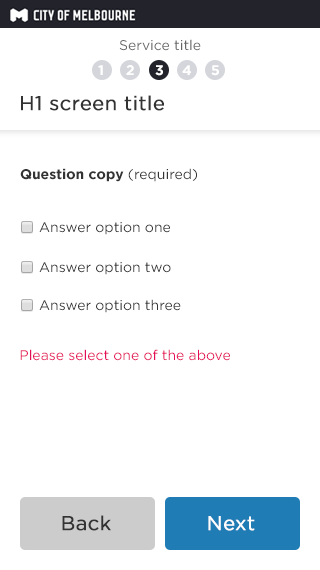

# Multiple choice question 

A question that captures an answer or multiple answers. We need to capture enough information to narrow down to a Salesforce case type (formerly know as SR code) we need to ask questions. We use questions to guide customers to groups of answers that tell us which work area should receive the Salesforce case.

These questions typically require a single answer, but sometimes multiple answers are appropriate for the service. 

## Single answer selection - Radio buttons

### Single choice answer
Screen consists of a label, serving as the question, followed by multiple radio buttons as answers.

Buttons
If the screen is the first in the form, then one button spanning the full width is used. 
The example above shows 'Back' and 'Next'.

### Validation error
If mandatory, then error message is triggered on validation when clicking 'Next'

Error messages
Content can be updated in wordpress

##Multiple answers selection - Check boxes

### Multiple choice answer
Screen consists of a label, serving as the question, followed by multiple check boxes as answers.

Buttons
If the screen is the first in the form, then one button spanning the full width is used. 
The example above shows 'Back' and 'Next'.

 
 
 ### Validation error
If mandatory, then error message is triggered on validation when clicking 'Next'

Error messages
Content can be updated in wordpress

