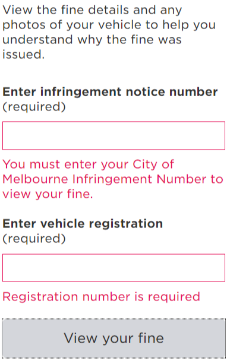
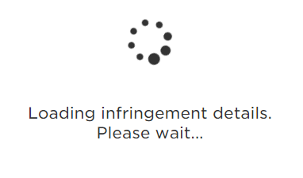

## What is it?

## How does this template work?

### 1.On page load

### 2.Error validation

### 3.Loading data

### 4.Fine details - results display

## Enhancements to come 

- DCI-296  - Authenticate to see issue details 
- DCI-300  - Authenticate to see issue details 

